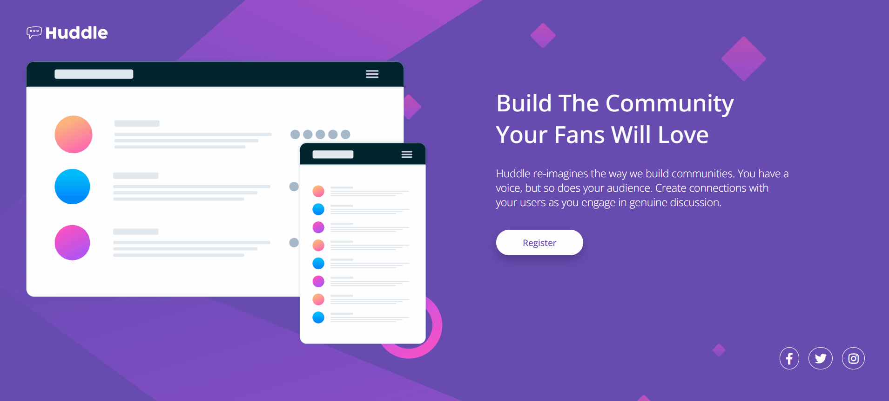
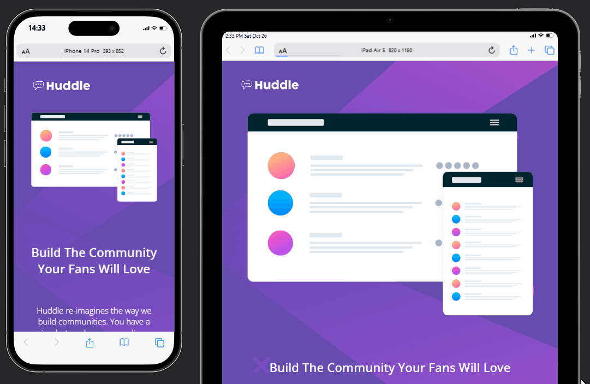

# PT-BR

    <h1 style="color: blueviolet">Projeto Huddle Base</h1>

<h3 >Prévia</h3>

Este é um projeto básico de uma página simples mas com uma boa estilização e responsividade, criado como um exercício ministrado pelo curso DevQuest Dev em Dobro ajudando a melhorar ainda mais meu conhecimento, escrita de código e semântica na programação !

<h2 style="color: aquamarine">Tecnologias</h2>

<figure style="height: 96px; weight: 96px; display: flex; justify-content: space-around; text-align:center; align-items: center;">
        

    

<h2 style="color: aquamarine">Responsivo Mobile e Tablet</h2>

<h2 style="color: aquamarine">Desafios</h2>

- Tive um pouco de dificuldade no ainhamento da imagem central junto como texto ao lado, mas com alguns ajustes consegui corrigir.

- Também tive dificuldades para ajustar o responsivo da imagem na parte mobile, mas com ajuda da equipe DevQuest Dev em Dobro conseguiram me sanar a dúvida e ajustar a imagem.

<h2 style="color: aquamarine">Conclusão e Agradecimento</h2>

Este projeto foi um grande desafio, mas com paciência, estudo, ajuda da equipe consegui concluir com êxito e aprimorar ainda mais minhas habilidades.

----------------------------------------------

# EN

<h1 style="color: blueviolet">Huddle Base Project</h1>

<h3 >Preview</h3>

This is a basic project of a simple page but with good styling and responsiveness, created as an exercise taught by the course DevQuest Double Dev helping to further improve my knowledge, code writing and semantics in programming!

<h2 style="color: aquamarine">Technologies</h2>

<figure style="height: 96px; weight: 96px; display: flex; justify-content: space-around; text-align:center; align-items: center;">   

 

 
<h2 style="color: aquamarine">Responsive Mobile and Tablet</h2>  

 

<h2 style="color: aquamarine">Challenges</h2>

- I had some difficulty aligning the central image with the text on the side, but with a few adjustments I was able to fix it.

- I also had difficulty adjusting the responsiveness of the image on the mobile side, but with the help of the DevQuest Dev em Dobro team they were able to clear up my doubts and adjust the image.

<h2 style="color: aquamarine">Conclusion and Thanks</h2>

This project was a great challenge, but with patience, study, and help from the team I was able to complete it successfully and further improve my skills.

